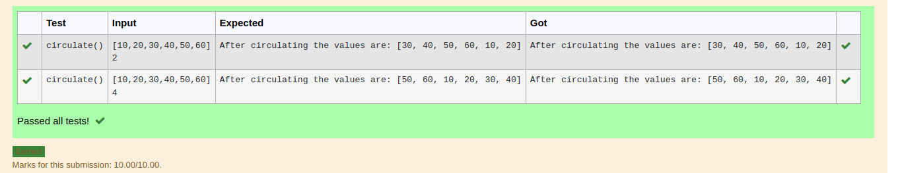

# Circulate-the-values-of-N-variables
## Aim:
To write a python program to circulate the n variables using function concept
## Equipment’s required:
PC
Anaconda - Python 3.7
## Algorithm: 
### Step 1: define the function
### Step 2: get input from the user
### Step 3: apply in the formula
### Step 4: print the output
## Program:
``` python 
#Program to circulate N values.
#Developed by: Siva Chandran R
#RegisterNumber:22005531
def circulate():
    a=eval(input())
    n=int(input())
    a=a[n:]+a[:n]
    print("After circulating the values are:",a)
    
  ```  

## Output:


## Result:
this program is used to circulate the n variables
